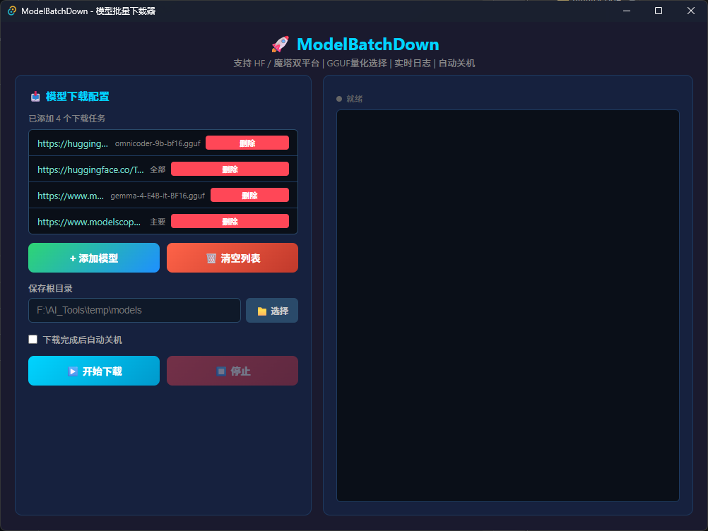

# ModelBatchDown

**模型批量下载器** — 支持 HuggingFace 和 ModelScope 双平台的离线模型批量下载工具



厌倦了手动管理模型下载？ModelBatchDown 帮你一键批量下载 AI 模型，支持 GGUF 量化版本选择和标准模型关键文件筛选。

[下载最新版本](https://github.com/eeyzs1/ModelBatchDown/releases) · [功能特性](#-功能特性) · [快速开始](#-快速开始)

---

## ✨ 功能特性

### 🔗 双平台支持

| 平台          | 镜像加速                                      | 说明                  |
| ----------- | ----------------------------------------- | ------------------- |
| HuggingFace | hf-mirror.com | 支持所有 HuggingFace 模型 |
| ModelScope  | modelscope.cn                             | 支持所有魔塔模型            |

### 📦 模型类型支持

| 模型类型      | 下载模式   | 说明                                          |
| --------- | ------ | ------------------------------------------- |
| GGUF 量化模型 | 量化版本选择 | 自动获取可用 GGUF 文件列表，用户可选择特定版本（Q3_K_M ~ Q8_0 等） |
| 标准模型      | 全部下载   | 下载模型所有文件                                    |
| 标准模型      | 主要下载   | 仅下载关键运行文件（config.json、safetensors 等）        |

### 🎯 核心功能

- **URL 自动解析** — 过滤 `/tree/main`、`/files` 等后缀，支持查询参数
- **任务持久化** — 下载任务保存到 JSON 文件，应用启动时自动恢复
- **下载控制锁定** — 下载期间禁用所有干扰按钮，防止误操作
- **停止二次确认** — 可选择删除未完成的文件夹
- **自动关机** — 下载完成后可选自动关机（延迟 60 秒）
- **实时日志** — 显示下载进度和错误信息

### 🛡️ 安全设计

- 下载时自动锁定：添加模型、清空列表、选择文件夹、删除任务等按钮
- 停止下载二次确认，防止误操作
- 任务数据持久化存储，异常退出后可恢复

---

## 🚀 快速开始

### 下载安装

前往 [Releases](https://github.com/eeyzs1/ModelBatchDown/releases) 页面下载最新版本：

| 文件                               | 说明                |
| -------------------------------- | ----------------- |
| `ModelBatchDown-1.0.0-setup.exe` | Windows 安装版（推荐）   |
| `ModelBatchDown-1.0.0.zip`       | Windows 便携版（解压即用） |
| `ModelBatchDown-1.0.0.dmg`       | macOS 安装版         |
| `ModelBatchDown-1.0.0.app.zip`   | macOS 便携版         |

### 快速使用

1. 点击 **"+ 添加模型"** 按钮
2. 输入模型链接（支持 HuggingFace 和 ModelScope）
3. 点击 **"🔍 解析地址"** 获取文件列表
4. 根据模型类型选择量化版本或下载模式
5. 点击 **"✓ 添加"** 添加到任务列表
6. 确认保存目录后点击 **"▶️ 开始下载"**

### 从源码构建

**前置条件：**

- Rust >= 1.70
- Node.js >= 18
- npm

**构建步骤：**

```bash
# 克隆仓库
git clone https://github.com/eeyzs1/ModelBatchDown.git
cd ModelBatchDown

# 安装依赖
cd src-tauri && npm install

# 构建 Tauri 前端
npm run build

# 编译便携版
cd ../.. && python -m PyInstaller run_download.py --onefile --name run_download_cli
```

---

## 🏗️ 项目结构

```
ModelBatchDown/
├── src-tauri/                          # Tauri 桌面前端
│   ├── src/
│   │   ├── index.html                 # 主界面 HTML
│   │   ├── main.js                    # 入口脚本
│   │   └── styles.css                 # 样式文件
│   └── src-tauri/
│       ├── src/
│       │   └── lib.rs                 # Rust 后端逻辑
│       ├── Cargo.toml                 # Rust 依赖
│       └── tauri.conf.json            # Tauri 配置
├── app/                               # Python 下载器
│   ├── platform/
│   │   ├── router.py                  # URL 解析和下载分发
│   │   ├── huggingface.py             # HuggingFace 下载实现
│   │   └── modelscope.py              # ModelScope 下载实现
│   ├── downloader/
│   │   └── batch.py                  # 批量下载管理
│   └── utils/
│       ├── shutdown.py                # 自动关机功能
│       ├── config.py                  # 配置管理
│       └── env_setup.py               # 环境变量设置
├── dist/                              # 编译产物
├── build/                             # 构建脚本产物
├── docs/                              # 项目文档
├── run_download.py                    # CLI 下载器入口
├── requirements.txt                   # Python 依赖
└── README.md                          # 本文件
```

---

## 🛠️ 技术栈

| 类别       | 技术                                    |
| -------- | ------------------------------------- |
| 桌面框架     | Tauri 2.x                             |
| 前端       | HTML + CSS + JavaScript               |
| 后端       | Rust                                  |
| 下载引擎     | Python (huggingface_hub + modelscope) |
| HTTP 客户端 | ureq                                  |
| 编译工具     | PyInstaller                           |

---

## 📄 许可证

本项目仅供个人学习和研究使用。未经授权，不得用于商业用途。

---

<div align="center">

**ModelBatchDown. Batch Download Your Models.**

</div>
